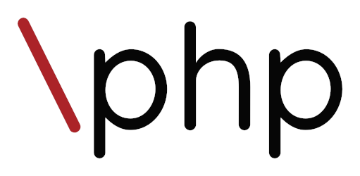

[](https://github.com/backslashphp/backslash/releases)
[](https://packagist.org/packages/backslashphp/backslash)

[](LICENSE)

# Backslash

**Modern and opinionated PHP library designed to facilitate the integration of CQRS and Event Sourcing patterns in your
application. Fully compliant with the [Dynamic Consistency Boundary](https://dcb.events/specification/) specification.**

> **DISCLAIMER**: While Backslash has been used in production for many years at
> the [FNQLHSSC](https://cssspnql.com/en/), it was originally tailored for a specific environment. As such, this library
> is provided *as is*, without any guarantees, warranties, or official support.

---

## Try it in action

The [demo application](https://github.com/backslashphp/demo) repository is the ideal starting point for learning
Backslash. Feel free to fork it and start experimenting!

## Installation

Add Backslash to your project with [Composer](https://getcomposer.org/):

```bash
composer require backslashphp/backslash
```

## Requirements

- PHP 8.2 or newer
- `ext-json` and `ext-pdo` (MySQL or SQLite) extensions enabled

## Documentation

> WORK IN PROGRESS

See the `/docs` folder for complete [documentation](./docs/README.md).

## Testing

```bash
vendor/bin/phpunit
```

## Credits

Backslash was crafted by [Maxime Gosselin](https://github.com/maximegosselin) in Québec, Canada.

## License

The MIT License (MIT). Please see [License File](LICENSE) for more information.
